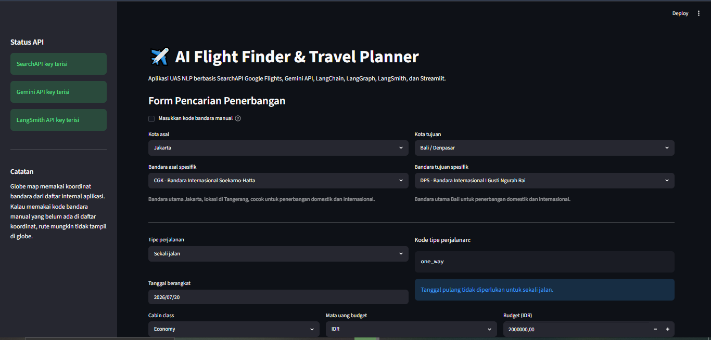
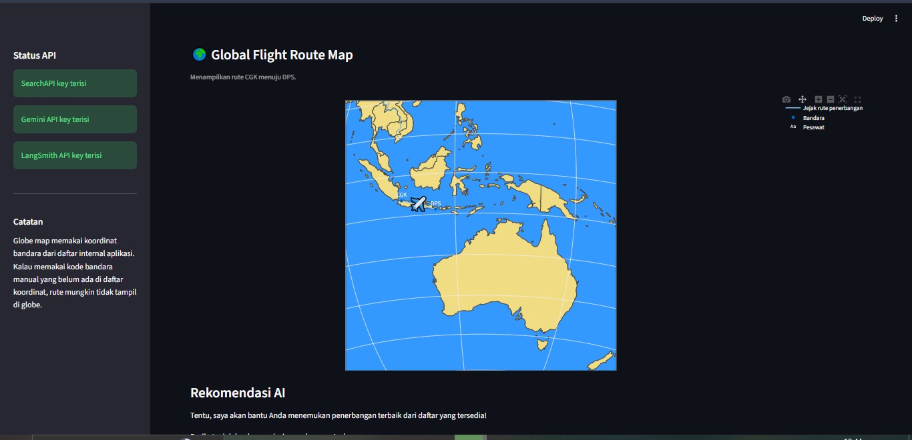
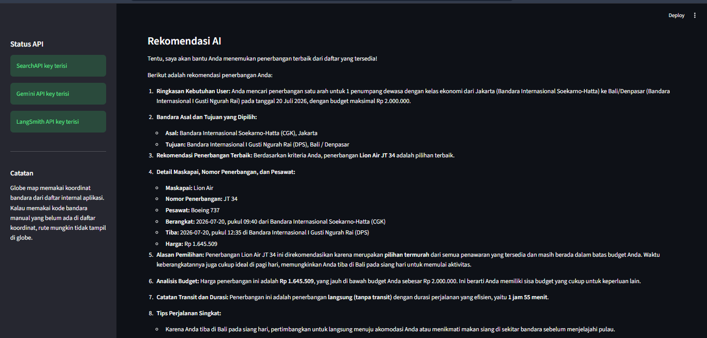
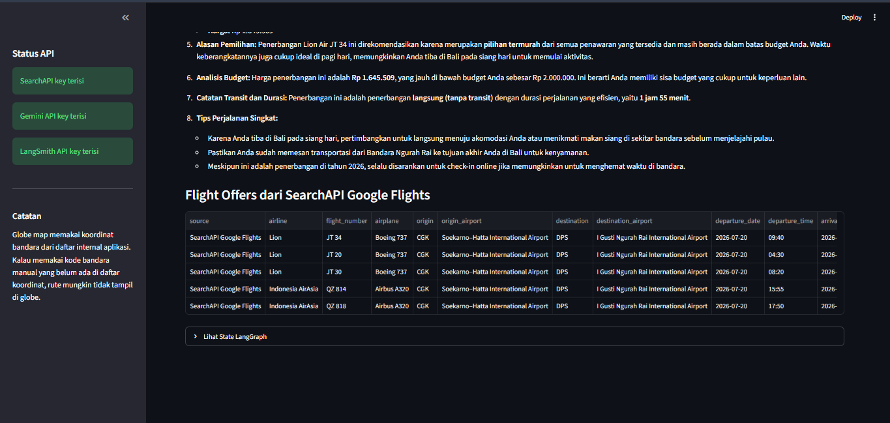

# AI Flight Finder & Travel Planner

## 1. Deskripsi Project

**AI Flight Finder & Travel Planner** adalah aplikasi berbasis Natural Language Processing (NLP) dan Large Language Model (LLM) yang membantu pengguna mencari serta mendapatkan rekomendasi penerbangan berdasarkan kebutuhan perjalanan.

Aplikasi ini memungkinkan pengguna memilih bandara asal, bandara tujuan, tanggal keberangkatan, tipe perjalanan, jumlah penumpang, kelas penerbangan, budget, dan mata uang. Setelah itu, sistem akan mengambil data penerbangan dari SearchAPI Google Flights, menganalisis hasil pencarian menggunakan workflow LangGraph, lalu menghasilkan rekomendasi penerbangan terbaik menggunakan LangChain dan Gemini API.

Project ini juga dilengkapi dengan visualisasi **globe map interaktif** yang menampilkan titik bandara asal, titik bandara tujuan, jejak rute penerbangan, dan ikon pesawat. Selain itu, proses kerja AI dapat dipantau menggunakan LangSmith tracing.

---

## 2. Tujuan Project

Tujuan dari project ini adalah membangun sistem berbasis NLP/LLM yang dapat:

1. Membantu pengguna mencari penerbangan berdasarkan kebutuhan perjalanan.
2. Memberikan rekomendasi penerbangan yang mudah dipahami.
3. Menganalisis harga, durasi, transit, maskapai, nomor penerbangan, pesawat, dan budget.
4. Menggunakan LangChain untuk prompt dan chain AI.
5. Menggunakan LangGraph untuk workflow berbasis graph.
6. Menggunakan LangSmith untuk tracing dan monitoring proses AI.
7. Menampilkan visualisasi rute penerbangan menggunakan globe map interaktif.

---

## 3. Fitur Aplikasi

Fitur utama aplikasi:

1. **Pemilihan Bandara Spesifik**
   User dapat memilih kota dan bandara secara spesifik.
   Contoh:

   * Jakarta: CGK / HLP
   * Tokyo: HND / NRT
   * London: LHR / LGW / STN / LCY

2. **Pencarian Data Penerbangan**
   Sistem mengambil data penerbangan menggunakan SearchAPI Google Flights.

3. **Rekomendasi AI**
   Gemini API digunakan untuk membuat rekomendasi penerbangan berdasarkan data penerbangan yang tersedia.

4. **Analisis Budget dan Mata Uang**
   User dapat memilih mata uang budget seperti IDR, USD, SGD, MYR, EUR, GBP, JPY, dan AUD.

5. **Workflow LangGraph**
   Alur sistem dibuat menggunakan LangGraph dengan node:

   * `search_flights`
   * `analyze_offers`
   * `generate_final_answer`

6. **Tracing LangSmith**
   LangSmith digunakan untuk melihat trace proses AI, input, output, durasi, dan error.

7. **Globe Map Interaktif**
   Visualisasi rute penerbangan ditampilkan dalam bentuk globe yang dapat diputar.

8. **Tabel Flight Offers**
   Aplikasi menampilkan tabel hasil pencarian penerbangan sebagai dasar rekomendasi AI.

---

## 4. Teknologi yang Digunakan

| Teknologi                | Fungsi                                                   |
| ------------------------ | -------------------------------------------------------- |
| Python                   | Bahasa pemrograman utama                                 |
| Streamlit                | Membuat tampilan web aplikasi                            |
| LangChain                | Membuat prompt, chain, dan menghubungkan data dengan LLM |
| LangGraph                | Membuat workflow AI berbasis graph                       |
| LangSmith                | Melakukan tracing dan monitoring proses AI               |
| Gemini API               | Model LLM untuk menghasilkan rekomendasi                 |
| SearchAPI Google Flights | Mengambil data penerbangan                               |
| Plotly                   | Membuat globe map interaktif                             |
| python-dotenv            | Membaca environment variable dari file `.env`            |
| requests                 | Mengirim request ke API                                  |

---

## 5. Arsitektur Sistem

Alur kerja sistem:

```text
User Input
    ↓
Streamlit UI
    ↓
LangGraph Workflow
    ↓
SearchAPI Google Flights
    ↓
Analisis Flight Offers
    ↓
LangChain Prompt
    ↓
Gemini API
    ↓
Rekomendasi AI
    ↓
Streamlit Output + Globe Map
    ↓
LangSmith Tracing
```

Penjelasan alur:

1. User mengisi form pencarian penerbangan.
2. Streamlit mengirim input ke workflow LangGraph.
3. LangGraph menjalankan node `search_flights`.
4. Sistem mengambil data penerbangan dari SearchAPI Google Flights.
5. LangGraph menjalankan node `analyze_offers`.
6. Sistem menganalisis harga, budget, durasi, transit, dan data penerbangan.
7. LangGraph menjalankan node `generate_final_answer`.
8. LangChain menyusun prompt dan mengirim data ke Gemini API.
9. Gemini menghasilkan rekomendasi penerbangan.
10. Streamlit menampilkan rekomendasi, tabel flight offers, state LangGraph, dan globe map.
11. LangSmith mencatat trace proses AI.

---

## 6. Penggunaan LangChain

LangChain digunakan pada file:

```text
src/chains.py
```

Komponen LangChain yang digunakan:

1. **ChatPromptTemplate**
   Digunakan untuk membuat template prompt rekomendasi penerbangan.

2. **ChatGoogleGenerativeAI**
   Digunakan untuk menghubungkan aplikasi dengan Gemini API.

3. **StrOutputParser**
   Digunakan untuk mengambil output model dalam bentuk teks.

Contoh alur LangChain:

```text
Flight Offers
    ↓
Prompt Template
    ↓
Gemini API
    ↓
Output Parser
    ↓
Rekomendasi AI
```

LangChain membuat sistem lebih terstruktur karena data penerbangan tidak langsung diberikan begitu saja ke user, tetapi terlebih dahulu dimasukkan ke prompt agar Gemini dapat menganalisisnya.

---

## 7. Penggunaan LangGraph

LangGraph digunakan pada file:

```text
src/workflow.py
```

Workflow terdiri dari tiga node utama:

### 1. search_flights

Node ini bertugas mengambil data penerbangan dari SearchAPI Google Flights.

Input:

* Bandara asal
* Bandara tujuan
* Tanggal berangkat
* Tanggal pulang
* Jumlah penumpang
* Cabin class
* Mata uang

Output:

* Raw flight offers

### 2. analyze_offers

Node ini bertugas menganalisis hasil pencarian penerbangan.

Proses:

* Mengurutkan penerbangan berdasarkan harga.
* Mengecek apakah harga masuk budget.
* Memilih beberapa flight offer terbaik.

Output:

* Selected flight offers

### 3. generate_final_answer

Node ini bertugas membuat rekomendasi akhir.

Proses:

* Jika ada error, sistem menampilkan pesan error.
* Jika tidak ada data, sistem menampilkan pesan bahwa penerbangan tidak ditemukan.
* Jika data tersedia, sistem memanggil LangChain dan Gemini API.

Output:

* Rekomendasi AI

Alur LangGraph:

```text
START
  ↓
search_flights
  ↓
analyze_offers
  ↓
generate_final_answer
  ↓
END
```

---

## 8. Penggunaan LangSmith

LangSmith digunakan untuk tracing proses AI.

Konfigurasi LangSmith terdapat pada:

```text
src/config.py
```

Environment variable yang digunakan:

```env
LANGSMITH_API_KEY=
LANGSMITH_PROJECT=AI-Flight-Planner-UAS
LANGSMITH_TRACING=true
```

Pada workflow, beberapa node diberi decorator `@traceable` agar dapat dipantau di dashboard LangSmith.

Node yang dilacak:

```text
search_flights_with_searchapi_google_flights
analyze_flight_offers
generate_final_recommendation
```

Manfaat LangSmith:

1. Melihat input dan output setiap proses.
2. Melihat durasi proses.
3. Membantu debugging.
4. Membuktikan bahwa LangChain dan LangGraph benar-benar berjalan.
5. Memudahkan evaluasi sistem AI.

---

## 9. Struktur Folder

```text
UAS_FLIGHT_PLANNER/
├── app.py
├── requirements.txt
├── .env.example
├── .gitignore
├── README.md
└── src/
    ├── __init__.py
    ├── airports.py
    ├── config.py
    ├── flight_search_api.py
    ├── chains.py
    ├── workflow.py
    ├── globe_map.py
    ├── gemini_test.py
    └── searchapi_test.py
```

Penjelasan file:

| File                       | Fungsi                                                   |
| -------------------------- | -------------------------------------------------------- |
| `app.py`                   | File utama aplikasi Streamlit                            |
| `src/airports.py`          | Daftar kota, bandara, kode IATA, dan mata uang           |
| `src/config.py`            | Membaca API key dan mengaktifkan LangSmith               |
| `src/flight_search_api.py` | Mengambil data penerbangan dari SearchAPI Google Flights |
| `src/chains.py`            | Implementasi LangChain dan Gemini API                    |
| `src/workflow.py`          | Implementasi LangGraph workflow                          |
| `src/globe_map.py`         | Visualisasi globe map interaktif                         |
| `src/gemini_test.py`       | Test koneksi Gemini API                                  |
| `src/searchapi_test.py`    | Test koneksi SearchAPI                                   |
| `.env.example`             | Contoh konfigurasi environment                           |
| `.gitignore`               | Mencegah file rahasia ikut ke GitHub                     |
| `requirements.txt`         | Daftar library Python                                    |
| `README.md`                | Dokumentasi project                                      |

---

## 10. Cara Instalasi dan Menjalankan Project

### 1. Clone Repository

```bash
git clone https://github.com/USERNAME/NAMA_REPOSITORY.git
cd NAMA_REPOSITORY
```

### 2. Buat Virtual Environment

Untuk Windows PowerShell:

```powershell
python -m venv .venv
.venv\Scripts\activate
```

Jika aktivasi virtual environment diblokir, jalankan:

```powershell
Set-ExecutionPolicy -Scope Process -ExecutionPolicy Bypass
.venv\Scripts\activate
```

### 3. Install Library

```powershell
pip install -r requirements.txt
```

### 4. Buat File `.env`

Copy file `.env.example` menjadi `.env`.

```powershell
copy .env.example .env
```

Lalu buka file `.env`:

```powershell
notepad .env
```

Isi API key:

```env
GOOGLE_API_KEY=isi_api_key_gemini
GEMINI_MODEL=gemini-2.5-flash

SEARCHAPI_KEY=isi_api_key_searchapi

LANGSMITH_API_KEY=isi_api_key_langsmith
LANGSMITH_PROJECT=AI-Flight-Planner-UAS
LANGSMITH_TRACING=true
```

### 5. Test API

Test Gemini API:

```powershell
python src\gemini_test.py
```

Test SearchAPI:

```powershell
python src\searchapi_test.py
```

### 6. Jalankan Aplikasi

```powershell
streamlit run app.py
```

Jika command `streamlit` tidak dikenali, gunakan:

```powershell
python -m streamlit run app.py
```

Aplikasi akan terbuka di browser melalui alamat:

```text
http://localhost:8501
```

---

## 11. Cara Menggunakan Aplikasi

1. Jalankan aplikasi dengan `streamlit run app.py`.
2. Pilih kota dan bandara asal.
3. Pilih kota dan bandara tujuan.
4. Pilih tipe perjalanan:

   * Sekali jalan
   * Pulang pergi
5. Pilih tanggal keberangkatan.
6. Jika pulang pergi, pilih tanggal pulang.
7. Pilih cabin class.
8. Pilih mata uang budget.
9. Masukkan jumlah budget.
10. Masukkan jumlah penumpang dewasa.
11. Klik tombol **Cari dan Buat Rekomendasi**.
12. Sistem akan menampilkan:

    * Rekomendasi AI
    * Tabel flight offers
    * Globe map
    * State LangGraph

---

## 12. Contoh Skenario Demo

Contoh pencarian domestik:

```text
Asal: Jakarta - Bandara Internasional Soekarno-Hatta (CGK)
Tujuan: Bali / Denpasar - Bandara Internasional I Gusti Ngurah Rai (DPS)
Tipe perjalanan: Sekali jalan
Cabin class: Economy
Mata uang: IDR
Budget: 2.000.000
```

Contoh pencarian internasional:

```text
Asal: London - London Heathrow Airport (LHR)
Tujuan: New York - John F. Kennedy International Airport (JFK)
Tipe perjalanan: Sekali jalan
Cabin class: Economy
Mata uang: USD
Budget: 1000
```

---

## 13. Kelebihan Project

1. Menggunakan tiga library wajib: LangChain, LangGraph, dan LangSmith.
2. Menggunakan data penerbangan dari API eksternal.
3. Menggunakan LLM untuk analisis rekomendasi.
4. Memiliki workflow AI yang jelas.
5. Memiliki tracing proses AI.
6. Memiliki visualisasi globe map interaktif.
7. Mendukung pilihan bandara spesifik.
8. Mendukung pilihan mata uang budget.
9. Memiliki tampilan web sederhana dan mudah digunakan.

---

## 14. Catatan Keamanan

File `.env` berisi API key dan tidak boleh diupload ke GitHub.

Pastikan `.gitignore` berisi:

```gitignore
.venv/
.env
__pycache__/
*.pyc
.streamlit/
```

Gunakan `.env.example` sebagai contoh konfigurasi tanpa API key asli.

---

## 15. Kesimpulan

Project **AI Flight Finder & Travel Planner** adalah sistem berbasis NLP/LLM yang membantu pengguna mencari dan memahami rekomendasi penerbangan. Sistem ini menggunakan LangChain untuk prompt dan chain, LangGraph untuk workflow, dan LangSmith untuk tracing.

Dengan tambahan SearchAPI Google Flights, Gemini API, Streamlit, dan Plotly Globe Map, project ini menjadi aplikasi AI yang tidak hanya menjawab pertanyaan, tetapi juga mengambil data, menganalisis pilihan, menampilkan rekomendasi, dan memvisualisasikan rute penerbangan secara interaktif.


## 16 SS 

1. TAMPILAN AWAL 


2. GLOBE MAP 


3. HASIL OUTPUT REKOMENDASI 

